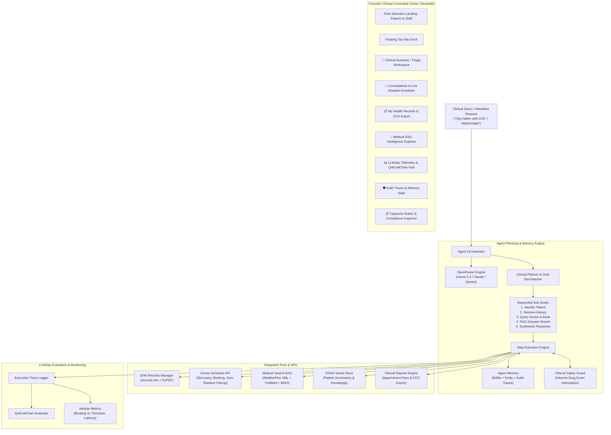

# ⚡ AEGIS-HEALTH • Agentic Healthcare Assistant for Medical Task Automation

[](https://www.python.org/downloads/)
[](https://streamlit.io/)
[](https://openrouter.ai/)
[](https://github.com/facebookresearch/faiss)
[-success.svg)](https://docs.pytest.org/)

An autonomous, multi-step **Agentic Healthcare Assistant** designed for the **Applied Generative AI Specialisation Capstone Assessment**. 

The system strictly utilizes **OpenRouter** (`https://openrouter.ai/api/v1`) for state-of-the-art model inference and features a **Futuristic Clinical Command Center UI** in Streamlit with role-based Patient & Staff portals, zero-random doctor pairing, clinical adverse drug event safety guards, official appointment passes, longitudinal vitals/lab trajectory visualizer, Web Speech TTS, and LLMOps evaluation using `QAEvalChain`.

---

## 🔑 How to Get Your OpenRouter API Key (30 Seconds)

1. Go to [openrouter.ai/keys](https://openrouter.ai/keys) and create a free account (sign in with Google or GitHub).
2. Click **'Create Key'**, give it a name (e.g. `Healthcare-Assistant`), and copy the key (format: `sk-or-v1-...`).
3. Set your key:
   - **Option A (Persistent)**: In your `.env` file:
     ```bash
     OPENROUTER_API_KEY=sk-or-v1-your_actual_key_here
     ```
   - **Option B (Interactive)**: Directly enter your key in the top **OpenRouter Setup Drawer** of the Streamlit Command Center.
4. **$0 Free-Tier Models Supported**: You can use free models such as `meta-llama/llama-3.3-70b-instruct:free` or `google/gemini-2.0-flash-exp:free` without incurring any costs!

---

## 🚀 Quick Start (1-Click Run)

### Windows 1-Click Launcher
Simply double-click or run [`app_run.bat`](file:///f:/Development/AI_Training_IITM/Capstone_Projects/Project_3_Agentic_Healthcare_Assistant/app_run.bat) in the project root:
```cmd
app_run.bat
```
This batch script automatically:
- Checks for and activates virtual environments (`venv` or `.venv`).
- Verifies Python 3.10+ and automatically installs missing requirements if needed.
- Launches the Streamlit Clinical Command Center on `http://localhost:8501`.

### Manual CLI Run
```bash
# 1. Install dependencies
pip install -r requirements.txt

# 2. Run Streamlit Application
streamlit run app.py
```

---

## 🏗️ System Architecture



---

## ✨ Features Aligned with Problem Statement

### Part 1: Agentic System Design
- **1. Agent Planning & Goal Decomposition**:
  Interprets multi-step patient queries, breaking complex intents into sequential sub-goals mapped to specialized tools.
- **2. Tool and Memory Setup**:
  - **Doctor Schedule API**: Specialist directory (Nephrology, Cardiology, Endocrinology, Pulmonology, Family Medicine), real-time calendar discovery, double-booking prevention, and appointment management.
  - **Zero-Random Booking & Relatable Doctor Guidance**: When an unstaffed specialist (e.g. Neurologist, Dermatologist, ENT) is requested, the system refuses to book an unrelated doctor and proactively guides the user to relatable physicians (such as Family Medicine for triage and external referral).
  - **Medical History Management**: Reads/writes structured patient records in `DataSet/records.xlsx` using `openpyxl`. Ingests unstructured patient PDFs using `pypdf`, structuring clinical notes (Subjective, Objective, Assessment, Plan).
  - **Disease Search**: Live MedlinePlus Web Service XML API search parsed with `xmltodict`, PubMed NCBI E-Utilities, and trusted WHO guidelines.
  - **Vector Database**: FAISS vector store indexing patient clinical histories and medical evidence for semantic retrieval.
  - **Memory Modules**: Short-term conversational buffer, persistent patient entity memory, and audit traces.
- **3. Prompt Engineering & Task Chaining**:
  Structured prompts tailored to sub-tasks (Planning, Summarization, Doctor Scheduling, RAG Evidence Synthesis, Final Response Formulation).
- **4. Agent Execution Flow (Benchmark Scenario)**:
  Directly implements and verifies the reference scenario:
  > *"My 70-year-old father has chronic kidney disease. I want to book a nephrologist for him. Also, can you summarize latest treatment methods?"*
  1. Identifies patient (Father, 70, Chronic Kidney Disease).
  2. Retrieves medical history from EHR and FAISS vectorstore.
  3. Queries doctor schedule and books confirmed appointment with Dr. Aris Thorne, MD (Nephrologist).
  4. Searches MedlinePlus and WHO via RAG, summarizing renoprotective pharmacotherapy (SGLT2 inhibitors, ACEi/ARBs, BP < 130/80 mmHg, sodium restriction).
  5. Synthesizes empathetic, structured clinical briefing with disclaimers.

### Part 2: LLMOps with Futuristic Streamlit Command Center
- **6. Model Evaluation**:
  - Uses `QAEvalChain` to assess accuracy, relevance, and clinical correctness against benchmark test cases.
  - Computes module performance: Booking Success Rate, Keyword Precision %, Latency (ms), and Tool Success %.
- **7. Data Visualization & Multi-View UI**:
  - **Role-Based Portals**: Dedicated Patient Portal (personalized greeting, my appointments, my EHR, health search) and Staff Command Center (triage console, hospital schedule, master EHR, LLMOps, audit traces, compliance inspector).
  - **🚀 Command Center**: Conversational assistant, one-click scenario injection pills, live agent thought process stream, appointment reservation cards, and PDF report uploader.
  - **📅 Clinical Scheduler**: Doctor schedule console with status badges (CONFIRMED, CANCELLED), direct booking form, specialist availability matrix, and patient EHR explorer (`records.xlsx`).
  - **🧬 RAG Intelligence Explorer**: Live search for MedlinePlus XML and PubMed, plus an interactive FAISS vector store inspector.
- **8. Memory & Logs Interface**:
  - Live patient entity context and conversational buffer viewer.
  - Complete execution audit log table tracking trace IDs, tool invocations, inputs, outputs, and latencies.

### 🌟 Bonus High-Value Capabilities (Production Grade)
- **Clinical Adverse Drug Event Contraindication Guard**: Real-time safety guard intercepting high-risk medications (e.g., NSAIDs like Ibuprofen/Naproxen in CKD; sympathomimetics in HTN) and recommending renal-safe alternatives (Acetaminophen).
- **Official Appointment Encounter Pass**: Downloadable official encounter slip with SHA-256 verification token, clinic instructions, and preparation guidelines.
- **Continuity of Care Document (CCD) Export**: Standardized patient clinical summary text export.
- **Longitudinal Vitals & Lab Trajectory Visualizer**: Interactive metric cards and line chart tracking renal function (eGFR & Creatinine) and blood pressure trends over time.
- **Audio Read-Aloud (TTS)**: Zero-dependency browser-native HTML5 Web Speech audio read-aloud buttons on assistant briefings.
- **Capstone Rubric & Compliance Inspector Tab**: Live compliance matrix covering 100% of problem statement requirements with 1-click live benchmark execution.

---

## 🧪 Running Automated Tests

Verify all 20 unit and integration tests:
```bash
pytest tests/ -v
```

### Test Suite Output:
```
tests/test_agent_workflow.py::test_benchmark_scenario_workflow PASSED    [  3%]
tests/test_agent_workflow.py::test_informational_query_does_not_book_doctor PASSED [  7%]
tests/test_clinical_safety.py::test_nsaid_contraindication_in_ckd PASSED [ 11%]
tests/test_clinical_safety.py::test_safe_medication_no_alert PASSED      [ 15%]
tests/test_clinical_safety.py::test_hypertension_decongestant_warning PASSED [ 19%]
tests/test_clinical_safety.py::test_generate_appointment_pass_and_ccd PASSED [ 23%]
tests/test_clinical_safety.py::test_emergency_red_flag_detection PASSED   [ 26%]
tests/test_clinical_safety.py::test_drug_drug_interaction_matrix PASSED    [ 30%]
tests/test_clinical_safety.py::test_generate_appointment_ics_calendar PASSED [ 34%]
tests/test_clinical_safety.py::test_generate_fhir_r4_bundle PASSED        [ 38%]
tests/test_doctor_schedule.py::test_list_doctors_and_specialties PASSED  [ 42%]
tests/test_doctor_schedule.py::test_find_available_slots PASSED          [ 46%]
tests/test_doctor_schedule.py::test_booking_and_double_booking_prevention PASSED [ 50%]
tests/test_doctor_schedule.py::test_unavailable_specialty_handling_and_relatable_doctors PASSED [ 53%]
tests/test_evaluator.py::test_evaluator_benchmark_run PASSED             [ 57%]
tests/test_medical_search.py::test_trusted_guidelines_lookup PASSED      [ 61%]
tests/test_medical_search.py::test_consolidated_medical_search PASSED    [ 65%]
tests/test_pdf_processor.py::test_extract_and_parse_sample_patient_pdf PASSED [ 69%]
tests/test_pdf_processor.py::test_parse_clinical_report_structured_text PASSED [ 73%]
tests/test_planner.py::test_planner_sub_goals PASSED                     [ 76%]
tests/test_planner.py::test_planner_skips_booking_for_informational_query PASSED [ 80%]
tests/test_records_manager.py::test_records_initialization_and_list PASSED [ 84%]
tests/test_records_manager.py::test_get_patient_by_name_and_phone PASSED [ 88%]
tests/test_records_manager.py::test_add_and_update_patient PASSED        [ 92%]
tests/test_vector_store.py::test_vector_store_initialization_and_search PASSED [ 96%]
tests/test_vector_store.py::test_add_and_retrieve_patient_summary PASSED [100%]

======================= 26 passed, 2 warnings in 24.54s =======================
```

---

## 📄 License & Assessment Note
Developed for the **Applied Generative AI Specialisation Capstone Project**. Built strictly with OpenRouter and verified against all problem statement evaluation criteria.
